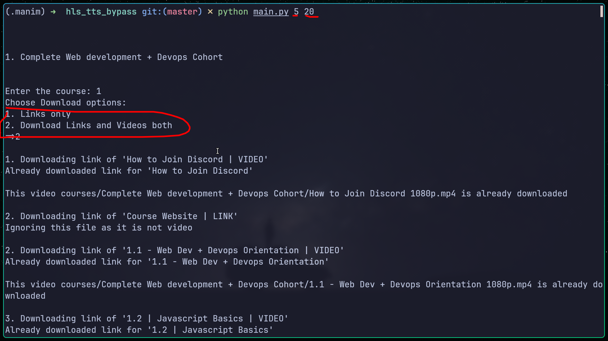

# Video Downloading bug report

This is a report generated from testing the website https://harkiratapi.classx.co.in and its dependency domain.

 In the github, 'courses folder contains html files and videos for course 'Complete Web development + Devops Cohort' to test for it. 
 
 I have downloaded video for only few seconds only about 30 segments of each video having quality 1080p. There is a script 'main.py' for performing everything in the report easily automating everything in python.

 This is tested only on this course: 'Complete Web development + Devops Cohort'
 So for other course, there may be slight differences. I don't have those courses so I cant test on them.

### Screenshots
 
 This is playing video in vlc after downloaidng using the script.

  
 This is running script 'main.py' with two paramter :1st no. of segment to download for testing i  used to download only 30, 2nd is no of thread to use to download multiple segment at once.


  
 This is running script 'test.py' with two paramter :1st file path the html of the video and second no of segment to download for testing, i have used 5 in screenshot.

 This script is used to download video if we have already html file available.


## Bugs
 I am able to download all encrypted videos of all  quality of the course i have purchased.
 Also without even downloading, i can share all the videos with anyone saving storage cost and transfer speed.

 So it has two bugs:
 1. Play and share videos by getting the html of the video file(No need to download any video)

You might say there is token expiration after playing it few times. Right?. But I am not talking about this. The expiration of token works to get the html file of the video that has all the video metadata. Once I get that file(html) having all the metadata, there is no need of token, any authorization at all. I can play video by live serving that html file locally saving in the computer.

So the bug is,once I get the video html file where video is playing, then there is no expiration system. By the way, you have to save the video html file locally and then run it locally.  Copying the link from the browser for that video won't work as it will again fetch the video metadata where there is token expiration.
  
 3. Download videos in all formats and decrypt it too.

 First bug is more severe than the second one as downloading huge size video, then sending need storage, faster speed and time.

## Consequences:
 The user who has bought the course can download all the vidoes or without downloading  share it for piracy.

## Solution:
 - First bug can be solved by implementing proper token validation and expiration of token in the server side.
 - Second bug can never be solved by just using encryption as anyone can always debug how the javascript is decrypting the video unless you use hls drm protection.

## Bug1 reproduction:

[Please click here](./Bug1.md) to see the step to reproduce the first bug of getting html file to play video.

By the way, i have reported the first bug earlier, they responded saying it will auto expire after playing it few times. But now I am able to download videos too by decrpting the video metadata, so I know for sure, there is no mechanism like that. There is no expiry system implemented and the video can be played any number of time and any duration of time.

## Bug2 reproduction
 For bug2, we need the html file of the video, to get that follow the bug1 reproduction step to get the html file.

 ### What's in the html file
    The html file contains html and javascript code build using Express server.

    It's body contains a script tag having json data which is common in express.

    The json looks something like this
    ```json
    {
        "props":{
        "pageProps":{
        "token":"f9c37531f7fff3e59f5d7222807ddb8e","watermark":"",
        "urls":[
            {"bitrate":"1080p","quality":"1080p","path":"https://appx-static.akamai.net.in/testing/ck-master.m3u8?quality=1080p","backup_url":"","backup_url2":"","kstr":"ofCJet/jv4whmoOx4lePOcmjIkPpxVt4P9MSxNjmj8A=","jstr":"Here the video m3u8 encrypted"},

            {"bitrate":"720p","quality":"720pp","path":"https://appx-static.akamai.net.in/testing/ck-master.m3u8?quality=720pp","backup_url":"","backup_url2":"","kstr":"ofCJet/jv4whmoOx4lePOcmjIkPpxVt4P9MSxNjmj8A=","jstr":"..."}],

            ,"isMobile":false,"isIos":false,"isLive":false,"quality":"720p","isPremier":"0","startDate":"","gcp_cookie":"",

            "datetime":"1734543680268",
            "ivb6":"nU1tCk8NtILJrLqndImffQ==",
            "enable_adaptivebitrate":0,"uhs_version":2},"__N_SSP":true},"page":"/secure-player","query":{"token":"f9c37531f7fff3e59f5d7222807ddb8e","watermark":""},"buildId":"vwKQXKVT-5n-Zj2R-SYja","isFallback":false,"gssp":true,"appGip":true,"scriptLoader":[]}

    ```

    In there, the important data is in 'urls' that have arrays of all quality of video details like bitrate,quality,path, and mainly kstr and jstr.

    - kstr: It is the encrypted key use to decrypt the AES-128 video decryption.(Sadly the key itself is encrypted)

    - jstr: It contains the m3u8 file of the video quality that contains all segments of the video,iv, urls etc(This is also encrypted)

    Task is very simple, decrypt the jstr,kstr  and then download each segments , decrypt them and combine them.

    let talk step by step, before that, list of things that are needed from the above json are
    : token, kstr,jstr,datetime,ivb6

### Finding the key to decrypt the jstr and kstr.

To find the key that can be used to decrypt the jstr and kstr is done by using the token and datetime from the above json.

algorith is given below in python.It returns 16,24,32 bit binary key based on the timestamp.

```python
def get_data_enc_key(time_val,token):
    # Extract parts of the string
    n = time_val[-4:]  # Last 4 characters of time_val
    r = int(n[0])  # First character of n as an integer
    i = int(n[1:3])  # Next two characters of n as an integer
    o = int(n[3])  # Last character of n as an integer
    
    # Create the new string
    a = time_val + token[r:i]
    
    # Create SHA-256 hash
    s = hashlib.sha256()
    s.update(a.encode('utf-8'))
    c = s.digest()
    
    # Determine the sign based on the value of o
    if o == 6:
        sign = c[:16]  # First 16 bytes
    elif o == 7:
        sign = c[:24]  # First 24 bytes
    else:
        sign = c  # Entire hash

    key = base64.b64encode(sign).decode('utf-8')
    
    return key

```
time_val parameter is timestamp and token is token from the json of the html file.


### Decrypting the jstr and kstr.

```python
def decrypt_data(data,key,ivb):
    i = b64decode(key)  # Key got from get_data_enc_key()
    o = b64decode(ivb)  # Initialization Vector (IV)
    a = b64decode(data)  # Encrypted data
    
    # Create AES Cipher object
    cipher = AES.new(i, AES.MODE_CBC, o)
    
    # Decrypt the data
    l = cipher.decrypt(a)
    
    # Convert decrypted data to a UTF-8 string
    dec = l.decode('utf-8')

    # Return the decrypted string
    return dec

```
data: it can be jstr and kstr. Same AES algorith is used to encrypt both.

key: The key found from the above step
ivb: ivb from the json


 From this we will get both the key to decrypt the video as well as m3u8 file. Use this for all video quality if you want.


 ### Decrypt first layer encryption of video segments
 Once we have the decrypted jstr, we have m3u8 having all segments, it is encypted using AES-128 but before that it is also encrypted using simple shift,xor manipulation.

 So first we have to decrypt using the simple method of obfuscation. The m3u8 segments can be in any following extensions:

 tsa,tsb,tsc,tsd,tse

 m3u8 decrypted from jstr looks like this

 ```m3u8
 #EXTM3U
#EXT-X-VERSION:3
#EXT-X-TARGETDURATION:6
#EXT-X-MEDIA-SEQUENCE:0
#EXT-X-PLAYLIST-TYPE:VOD
#EXT-X-KEY:METHOD=AES-128,URI="url from where to fetch the key",IV=0xa65c79d2237b4a594bc17047c7272f8b
#EXTINF:5.933333,
https://appx-transcoded-videos-mcdn.akamai.net.in/videos/harkirat-data/85929-1722860925/hls-drm-37ade3/720p/master-5673378.839810446-0.tse
#EXTINF:4.166667,
https://appx-transcoded-videos-mcdn.akamai.net.in/videos/harkirat-data/85929-1722860925/hls-drm-37ade3/720p/master-5673378.839810446-1.tse
#EXTINF:4.166667,
https://appx-transcoded-videos-mcdn.akamai.net.in/videos/harkirat-data/85929-1722860925/hls-drm-37ade3/720p/master-5673378.839810446-2.tse
#EXTINF:4.166667,

 ```

 Also, the URI path which is used to get key of the video by sending request is not used. Instead the jstr key is used returned in the html.

 May be for some video(Not in the course i have tested), they may be use URI for key if kstr is not present in the html.

 So far i have not encountered any other format, if found, then skip the first decryption process.  To decrypt each segments after downloading,use this function for each type of extension for all the segments.

 ```python
 def decode_video_tsa(input_string):
    shift_value = 0xa * 0x2  # 3 in decimal
    result = ''
    
    for char in input_string:
        char_code = ord(char)  # Get the Unicode code point of the character
        xor_result = char_code -shift_value  
        result += chr(xor_result)  # Convert back to a character and append to the result
        
    binary_data = base64.b64decode(result)

    return binary_data


def decode_video_tsb(input_string):
    xor_value = 0x3  # 42 in decimal
    shift_value = 0x2a  # 3 in decimal
    result = ''
    
    for char in input_string:
        char_code = ord(char)  # Get the Unicode code point of the character
        xor_result = char_code >> xor_value  
        shifted_result = xor_result ^ shift_value  
        result += chr(shifted_result)  # Convert back to a character and append to the result
        
    binary_data = base64.b64decode(result)

    return binary_data

def decode_video_tsc(input_string):
    shift_value = 0xa  # 3 in decimal
    result = ''
    
    for char in input_string:
        char_code = ord(char)  # Get the Unicode code point of the character
        xor_result = char_code - shift_value  
        result += chr(xor_result) 
        
    binary_data = base64.b64decode(result)

    return binary_data

def decode_video_tsd(input_string):
    shift_value = 0x2  # 3 in decimal
    result = ''
    
    for char in input_string:
        char_code = ord(char)  # Get the Unicode code point of the character
        # xor_result = char_code ^ shift_value  # Perform XOR with the constant
        shifted_result = char_code >> shift_value  
        result += chr(shifted_result)  
    binary_data = base64.b64decode(result)

    return binary_data


def decode_video_tse(input_string):
    xor_value = 0x3  # 42 in decimal
    shift_value = 0x2a  # 3 in decimal
    result = ''
    
    for char in input_string:
        char_code = ord(char)  # Get the Unicode code point of the character
        xor_result = char_code ^ shift_value  
        shifted_result = xor_result >> xor_value  
        result += chr(shifted_result)  # Convert back to a character and append to the result
        
    binary_data = base64.b64decode(result)

    return binary_data


 ```

 For each extension , use the approriate function.

 input_string: all the content return by downloading each segment url.

 Do this decryption for all the segments after downloading.


 ### Decrypt second layer encryption
 The second is simple standard hls encryption using AES-128. For that we need decrypted kstr which we have and iv which we can get from the m3u8.

 ```python3
    cipher = AES.new(kstr, AES.MODE_CBC, iv)
    segment_data = cipher.decrypt(segment_data)

 ```
 kstr is decrypted kstr which is key to decrypt the video segment and iv is iv which we can get from m3u8.

 Combine all the segments video and thats all.

 
